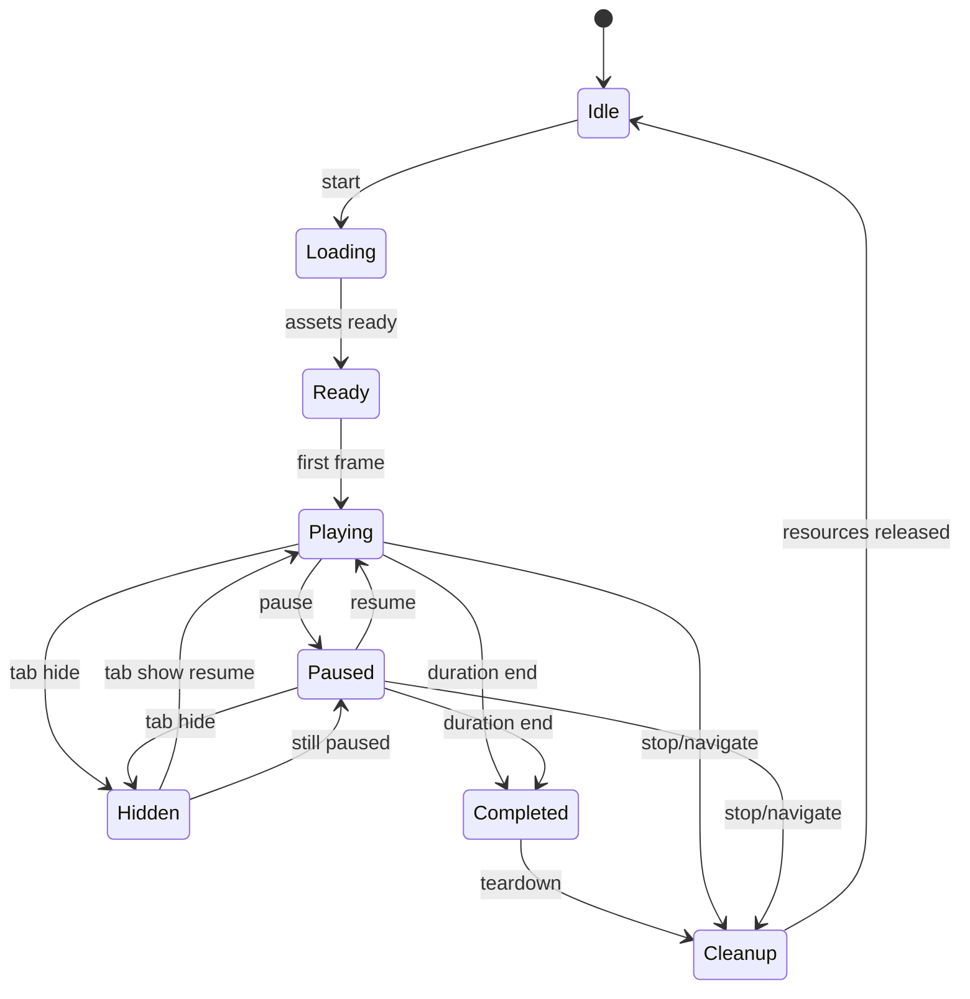

# Runtime Lifecycle

| Transition | Timers | Media | WebGL | Canvas | Listeners | HLS | Audio |
|------------|--------|-------|-------|--------|-----------|-----|-------|
| Idle→Loading | start heartbeat if tracked | preload intentional | none (Hamsa lazy) | mount DOM | add | create on source | prepare |
| Playing→Paused | keep session clock paused | pause decode | stop loops / dispose Hamsa on stop | hold last frame | keep | keep buffered | pause |
| Playing→Hidden | skip heartbeat | pause nonessential | stop loops | hold | keep | pause | pause |
| Hidden→Visible | resume heartbeat | soft-resume | resume if playing | redraw | keep | resume | resume |
| *→Cleanup | clear | destroy/reset | loseContext | clear | remove tracked | destroy | dispose |
| Cleanup→Idle | none | none | 0 | static | baseline | 0 | 0 |
