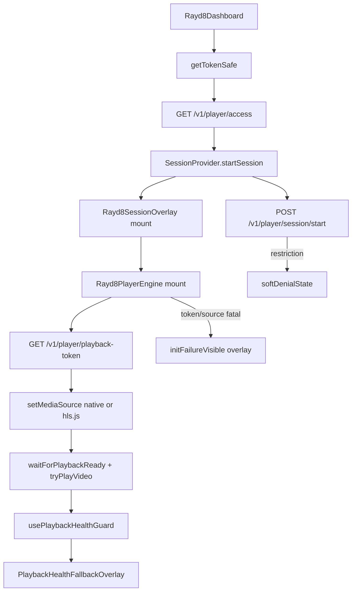

# 02 — Dependency Map

## Primary Express / REGEN chain

## Block / timeout / cancel / unmount points

| Point | Mechanism | Blocks startup? | Cancels in-flight? |
|---|---|---|---|
| Missing Clerk token | Dashboard gate | Yes (pre-mount) | N/A |
| `/access` deny | Dashboard soft UI | Yes (pre-mount) | N/A |
| `startSession` client flip | Immediate `isActive` | Mount proceeds | Clears prior soft-denial |
| `/session/start` failure | Soft denial / tracking fail | May show soft denial; player may still init | Does not abort token fetch |
| Health guard 5s | Soft recovery (`play()` retry) | No UI yet | No |
| Health guard 9s | `status=failed` → overlay | Shows mislabeled "session startup" UI | No |
| Init effect cleanup | `cancelled=true`, abort preload controller | Stops current init | Yes (local only) |
| `endSession` / Return Home | Unmount engine + finalize session | Tears down | Best-effort async end |
| Umami inject | idle callback | **No** | N/A |
| Adaptive iframe message | best-effort postMessage | **No** | N/A |

## Concurrency note (critical)

After `startSession`, **player mount**, **`/session/start`**, **playback-token**, and **health timers** are effect-driven and **not serialized**. Health timers can expire even when backend session creation succeeded.
